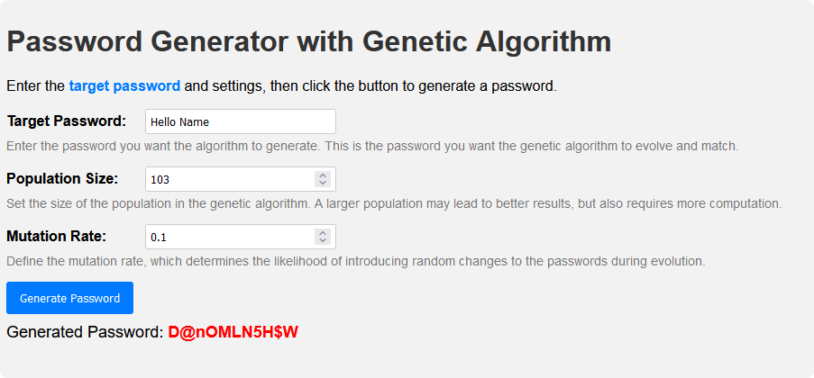

# Introduction

This is a simple password genrate use Genetic Algorithm.

Genetic Algorithm is a search heuristic that is inspired by Charles Darwin’s theory of natural evolution. This algorithm reflects the process of natural selection where the fittest individuals are selected for reproduction in order to produce offspring of the next generation.

Some steps of Genetic Algorithm:

1. Initial population
2. Fitness function
3. Selection
4. Crossover
5. Mutation
6. Repeat

Demo : https://chuongmep.github.io/genpass/

